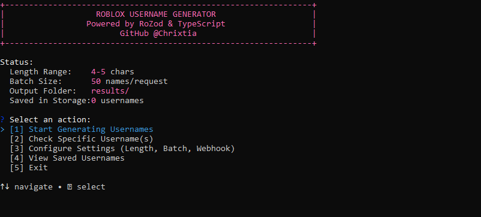

<div align="center">

# Roblox Username Generator

A modern, high-performance Roblox username generator, sniper, and availability checker with an interactive terminal CLI interface.

[](https://www.typescriptlang.org/)
[](https://nodejs.org/)
[](https://rozod.alrovi.com/)
[](LICENSE)

<br/>
<br/>



</div>

---

## Overview

This tool combines high-throughput batch querying via **RoZod** with Roblox's registration validation APIs to rapidly discover and verify unclaimed Roblox usernames. It features an interactive terminal user interface, customizable naming rules, automated Discord webhook alerts, and persistent session storage categorized by Unix timestamp.

> [!] **Note:** Powered by [`rozod`](https://rozod.alrovi.com/), the official TypeScript API wrapper for Roblox web services, ensuring reliable endpoints and automated CSRF handling.

---

## Highlights

| Feature | Description |
|---|---|
| **Interactive Terminal CLI** | Arrow-key menu interface for instant scanning, configuration, and result inspection. |
| **High-Throughput Batch Checking** | Checks 50–100 usernames per request via `POST /v1/usernames/users` (`usersv1`). |
| **Strict Sign-Up Validation** | Verifies candidate usernames with `GET /v1/usernames/validate` (`authv1`) to reject filtered/moderated names. |
| **Roblox Rule Compliance** | Generates names compliant with Roblox rules (3–20 chars, alphanumeric, max 1 non-terminal underscore). |
| **Unix Timestamp Storage** | Stores discovered usernames in a dedicated folder (e.g. `results/1727923456.txt`). |
| **Discord Webhook Alerts** | Posts embeds directly to your Discord server with clickable registration links. |

---

## Installation

### Prerequisites
- [Node.js](https://nodejs.org/) v18.0.0 or later
- npm (installed with Node.js)

### Clone & Install

```bash
git clone https://github.com/Chrixtia/Roblox-Username-generator.git
cd Roblox-Username-generator
npm install
```

---

## Quick Start

Launch the interactive CLI interface:

```bash
# Development mode (Instant execution with TSX)
npm run dev

# Or build and launch production
npm run build
npm start
```

> [!] **Tip:** If you want to bypass the interactive menu and start scanning immediately (e.g. for background scripts or servers), run: `npm start -- --start`

---

## CLI Features

### `[1] Start Generating Usernames`
Begins scanning with the configured rules. Displays real-time progress:
```text
[AVAILABLE] >> cool_name <<
   Saved: 1727923456.txt | Length: 9

[STATUS] Checked: 2,450 | Found: 6 | Rate: 110/s | [Ctrl+Q to stop]
```
> [!] **Important:** The live status line remains pinned to the bottom of your screen. Press `Ctrl+Q` (or `Ctrl+C`) at any time during scanning to stop the generator and safely return to the main menu without terminating the process.

### `[2] Check Specific Username(s)`
Allows ad-hoc querying of specific usernames from the terminal:
```text
Results:
  [TAKEN]      builderman (Already registered)
  [AVAILABLE]  available_user (Ready to register: https://www.roblox.com/signup)
  [MODERATED]  bad_name (Username not appropriate for Roblox)
```

### `[3] Configure Settings`
An interactive editor allowing you to customize generation lengths, allow/disallow characters, batch sizes, delays, output folder, and Discord webhooks without manually editing JSON files.

### `[4] View Saved Usernames`
Lists all timestamped result files in your output directory and lets you inspect previously discovered usernames directly in your terminal.

---

## Configuration Reference

Settings can be managed either through the interactive CLI menu or by editing [`config.json`](./config.json):

<details>
<summary><b>Click to expand <code>config.json</code> options</b></summary>

```json
{
  "minLength": 4,
  "maxLength": 5,
  "batchSize": 50,
  "checkDelayMs": 600,
  "allowUnderscores": true,
  "allowNumbers": true,
  "validateRegistration": true,
  "outputDir": "results",
  "webhook": {
    "enabled": false,
    "url": "https://discord.com/api/webhooks/..."
  }
}
```

| Field | Type | Default | Description |
|---|---|---|---|
| `minLength` | `number` | `4` | Minimum username length (3–20) |
| `maxLength` | `number` | `5` | Maximum username length (3–20) |
| `batchSize` | `number` | `50` | Number of usernames checked per batch request (1–100) |
| `checkDelayMs` | `number` | `600` | Delay between batch requests in milliseconds |
| `allowNumbers` | `boolean` | `true` | Include numbers `0-9` in generated names |
| `allowUnderscores` | `boolean` | `true` | Include a compliant single underscore `_` |
| `validateRegistration` | `boolean` | `true` | Verify signup availability with Roblox Auth API |
| `outputDir` | `string` | `"results"` | Directory where timestamped files are stored |
| `webhook.enabled` | `boolean` | `false` | Enable or disable Discord notifications |
| `webhook.url` | `string` | `""` | Discord webhook URL (or use `DISCORD_WEBHOOK_URL` env var) |

</details>

---

## Automated Tests

Run the test suite to verify username generation constraints, Unix timestamp storage, and live RoZod endpoint integration:

```bash
npm test
```

---

## Architecture

```text
src/
├── ui/
│   ├── colors.ts         # Terminal color palette (pink primary accent)
│   ├── menu.ts           # Main interactive CLI menu router
│   ├── scanner.ts        # Live scanner runner with sticky bottom status line
│   ├── adHocChecker.ts   # On-demand username checker
│   ├── configEditor.ts   # Real-time settings editor (full view, no scrolling)
│   └── savedViewer.ts    # Timestamped result file viewer
├── checker.ts            # RoZod client wrapper (usersv1 & authv1)
├── generator.ts          # Rule-compliant username generator
├── storage.ts            # Unix timestamp folder storage engine
├── webhook.ts            # Discord webhook embed dispatcher
├── config.ts             # Typed configuration loader & validator
└── index.ts              # CLI entry point
```

---

## Contact & Developer

<div align="center">

[](https://github.com/Chrixtia)
&nbsp;
[](https://discord.com/users/1443584667235389623)
&nbsp;
[](mailto:christian.pangan.viente@gmail.com)

</div>

---

## License

This project is licensed under the MIT License - see the [LICENSE](LICENSE) file for details.
